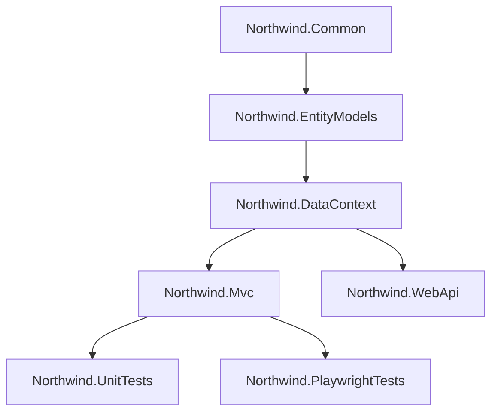

# MatureWeb

Enterprise-grade web application showcasing modern .NET development patterns with clean architecture.

[](https://dotnet.microsoft.com/)
[](https://docs.microsoft.com/en-us/ef/core/)
[](LICENSE)

## Overview

A multi-project solution demonstrating layered architecture with:
- MVC frontend for product catalog
- REST API with JWT authentication
- Umbraco CMS integration
- Comprehensive test coverage

## Solution Structure

```
MatureWeb/
├── Northwind.Common          # Shared utilities
├── Northwind.EntityModels    # Domain entities
├── Northwind.DataContext     # Data access layer
├── Northwind.Mvc             # MVC web app
├── Northwind.WebApi          # REST API
├── Northwind.UnitTests       # xUnit tests
├── Northwind.PlaywrightTests # E2E tests
└── Northwind.Cms             # Umbraco CMS
```

## Getting Started

### Prerequisites

- [.NET 10 SDK](https://dotnet.microsoft.com/download)
- [Node.js](https://nodejs.org/) (for Playwright)

### Run the Application

```bash
# Clone and build
git clone https://github.com/yourusername/MatureWeb.git
cd MatureWeb
dotnet build

# Start MVC app
cd Northwind.Mvc
dotnet run
# Open http://localhost:5000

# Start API (separate terminal)
cd Northwind.WebApi
dotnet run
# Open http://localhost:5251/swagger
```

## API Authentication

The API uses JWT Bearer authentication.

```bash
# Get token
curl -X POST http://localhost:5251/api/auth/login \
  -H "Content-Type: application/json" \
  -d '{"email":"admin@northwind.com","password":"admin123"}'

# Use token
curl http://localhost:5251/api/products/low-stock \
  -H "Authorization: Bearer YOUR_TOKEN"
```

## Testing

```bash
# Unit tests
dotnet test Northwind.UnitTests

# E2E tests (requires app running)
cd Northwind.PlaywrightTests
dotnet build
pwsh bin/Debug/net10.0/playwright.ps1 install
dotnet test
```

## Tech Stack

| Layer | Technology |
|-------|------------|
| Runtime | .NET 10, C# 14 |
| ORM | Entity Framework Core 10 |
| Web | ASP.NET Core MVC/API |
| Auth | JWT Bearer |
| CMS | Umbraco 17 |
| Testing | xUnit, Moq, Playwright |
| Frontend | Bootstrap 5, jQuery |

## Key Features

- **Product Catalog** - Browse, search, filter products by category
- **REST API** - Full CRUD with Swagger documentation
- **Authentication** - JWT-based auth with role support
- **CMS** - Content management via Umbraco
- **Localization** - English/Indonesian support
- **Caching** - In-memory caching for performance

## Project Dependencies



## License

This project is licensed under the MIT License - see the [LICENSE](LICENSE) file for details.

---

Built with ❤️ using .NET 10
